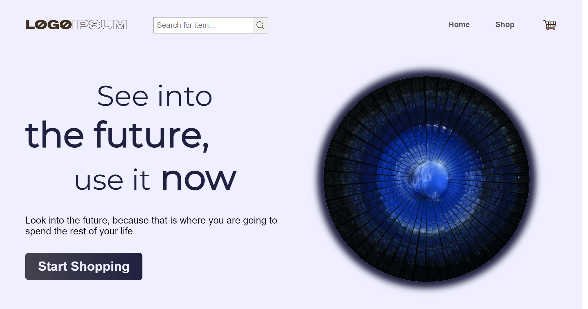
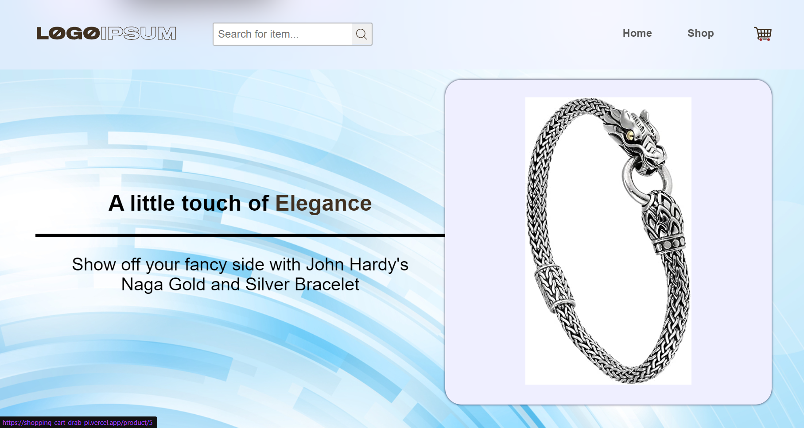
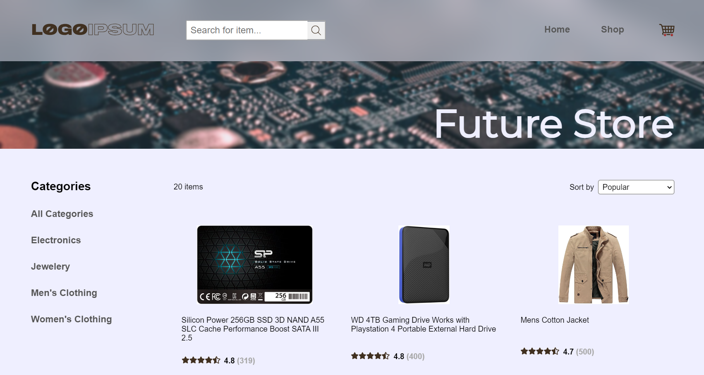
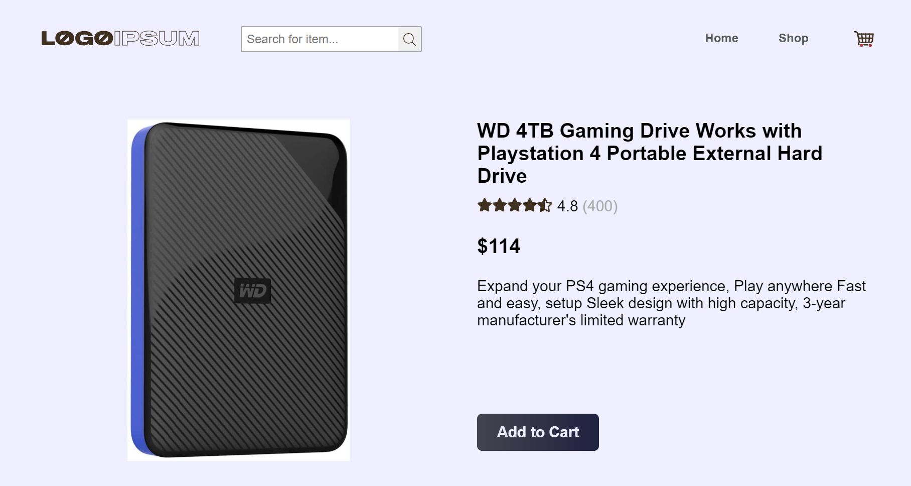
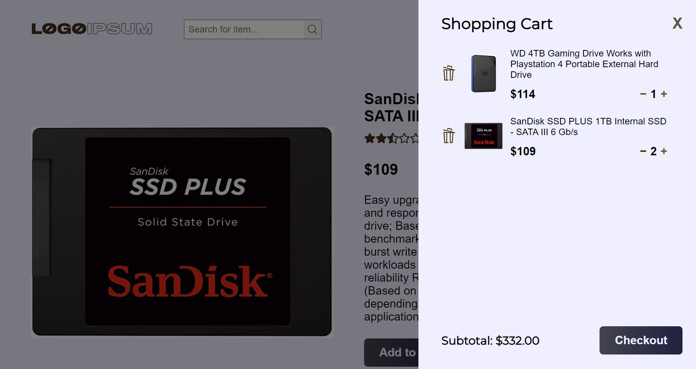
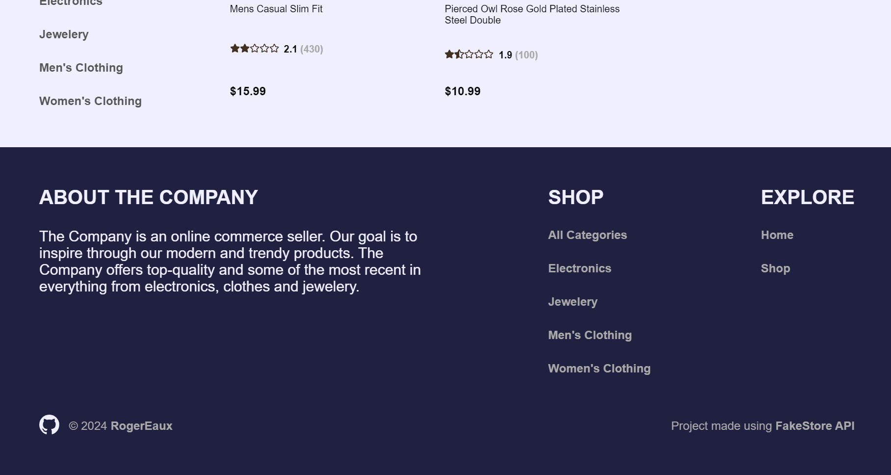

# Project - Shopping Cart

'Future Store' is a mock-up of an online shopping store. The website offers a range of products from tech to clothes to jewelery. This project was created as a practice on using React Router and testing UI elements using the React Testing Library and Vitest and is made possible by using data from [FakeStore API](https://fakestoreapi.com/).

[Checkout the live version here](https://shopping-cart-drab-pi.vercel.app/).

## Features

- Pages: The site is structures in different pages: Home, Shop and Product pages.

  - The Home page acts as a welcome to users using attractive imagery and effects to catch users' attention while displaying some of the products within the shop and offering the opportunity to explore.
  - The Shop page functions as the display case for all the products offered in the shop. From here users can navigate to each of the individual products
  - The Product page delivers more details about each of the products in the shop and lets users add them to their cart

- Cart: The cart allows users to add, remove and edit the quantities of the products found in the shop. The cart can be accessed at any page in the shop

- Category List: The category list lets users filter all the shop products by their desired category, showing only those that match that given category

- Product Search: The search bar gives users the opportunity to search for a specific category, displaying the products whose title or description matches the searched query

- Product Sorter: The sorter allows users to sort the products by a certain quality, be it price, name or popularity. This can be combined with the category or search filter to provide a better user experience when searching for a product

- Responsive: The design of the website is inherently responsive taking advantage of different viewing sizes to display the content in both aesthetically pleasing and effective ways

## Built using

- Vite + React
- React Router
- Vitest with React Testing Library
- CSS modules
- HTML
- FakeStore API

## Screenshots

Home Page - Header Section



Home Page - Product Ad Section



Shop Page



Product Page



Cart Section



About The Company Section



## Run locally

To setup and work on this project locally:

1. Clone the project

HTTP

```
$ git clone https://github.com/RogerEaux/shopping-cart.git
```

SSH

```
$ git clone git@github.com:RogerEaux/shopping-cart.git
```

2. Move to the cloned directory

```
cd shopping-cart
```

3. Install dependencies

```
npm install
```

4. Start the server

```
npm run dev
```
